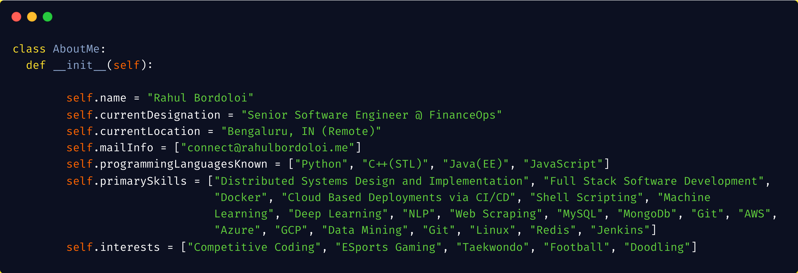

## Hola! 👋  

    
    
    <!---->
    
    
    
    
    

## About Me :

I'm a Vivid Pythonista :snake:, but C++ by :heart:. Linux Fanboy :penguin:.  
Passionate about Converting Problem Statements into Efficient and Automated Solutions. 
Currently working as a Data Scientist (ASE-1) at HighRadius, Bhubaneswar. Much passionate about contributing to the Open Source Community :octocat:.
 

<!--[Linkedin](https://linkedin.com/in/rahulbordoloi)  
[Blog](https://dev.to/rahulbordoloi)  
[Twitter](https://twitter.com/DevR07)  -->

<!--
**rahulbordoloi/rahulbordoloi** is a ✨ _special_ ✨ repository because its `README.md` (this file) appears on your GitHub profile.

Here are some ideas to get you started:

- 🔭 I’m currently working on ...
- 🌱 I’m currently learning ...
- 👯 I’m looking to collaborate on ...
- 🤔 I’m looking for help with ...
- 💬 Ask me about ...
- 📫 How to reach me: ...
- 😄 Pronouns: ...
- ⚡ Fun fact: ...
-->

<a align="center" href="https://rahulbordoloi.me">

&nbsp;

</a>

<!--  -->

[Note : Jupter Notebook Contributions are excluded from here]

 

<!--  -->
<!--  -->

<!-- 

  -->

<!--  -->

To know more About Me, visit my [Portfolio](https://rahulbordoloi.me).  

<!---->

